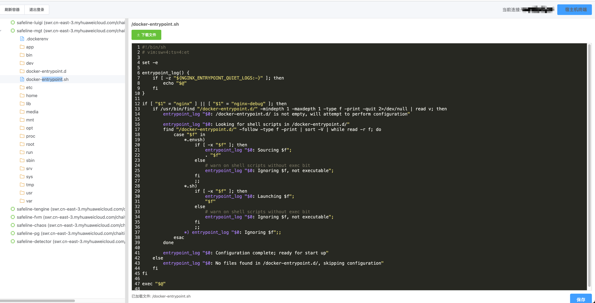

# Container Tool

一个基于 Web 的 Docker 容器管理工具，支持通过 SSH 连接远程主机，并提供容器文件管理、终端访问等功能。

## 功能特性

- 🔐 SSH 远程连接
- 🐳 Docker 容器管理
  - 查看容器列表
  - 容器文件系统浏览
  - 文件内容查看和编辑
  - 文件上传和下载
- 💻 终端访问
  - 容器内终端
  - 主机终端
- 🌐 Web 界面
  - 现代化的用户界面
  - 实时文件操作
  - 实时终端交互

## 界面展示



## 系统要求

- Go 1.24.2 或更高版本
- Docker 已安装并运行
- SSH 服务已启用

## 安装

1. 克隆仓库：
```bash
git clone https://github.com/yourusername/container_tool.git
cd container_tool
```

2. 安装依赖：
```bash
go mod tidy
```

3. 编译项目：
```bash
go build -o container_tool
```

4. 运行服务：
```bash
./container_tool
```

或者使用 Docker 运行：
```bash
docker build -t container_tool .
docker run -p 8080:8080 container_tool
```

## 使用方法

1. 访问 Web 界面：
   - 打开浏览器访问 `http://localhost:8080`

2. SSH 登录：
   - 输入远程主机的 SSH 连接信息
   - 主机地址
   - 端口
   - 用户名
   - 密码

3. 容器管理：
   - 查看容器列表
   - 选择容器进行文件操作
   - 使用终端功能

## API 接口

- `POST /api/login` - SSH 登录
- `GET /api/containers` - 获取容器列表
- `GET /api/container/:id/files` - 获取容器文件列表
- `GET /api/container/:id/file` - 获取文件内容
- `POST /api/container/:id/file` - 保存文件内容
- `POST /api/container/:id/upload` - 上传文件
- `GET /api/container/:id/download` - 下载文件
- `GET /api/terminal/:id` - 容器终端
- `GET /api/host-terminal` - 主机终端

## 许可证

MIT License
